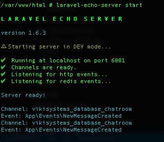
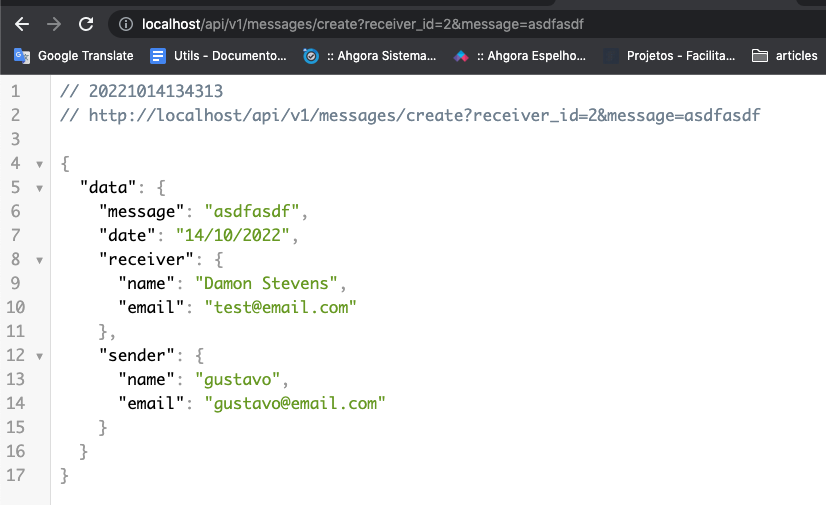

# Socket Io

### Git
```

composer require laravel/sanctum:^2
php artisan vendor:publish --provider="Laravel\Sanctum\SanctumServiceProvider"

touch database/database.sqlite

https://github.com/especializati/larachat
https://github.com/especializati/larachat.git

```

### Commands
```

composer require laravel/ui:^3.2

php artisan ui vue --auth

apk add --update nodejs npm

npm install && npm run dev

npm install --save laravel-echo socket.io-client

php artisan make:controller Api\\ChatApiController
php artisan make:resource MessageResource
php artisan make:request StoreMessage

php artisan make:event NewMessageCreated

npm install -g laravel-echo-server

laravel-echo-server init
laravel-echo-server start
//laravel-echo-server start --dir=/var/www/html/

```

### PGSQL
```

psql -d postgres -U postgres

\l # list databases

\c # connect to database

\dt # show tables

\d table # describe table

select * from customers;

```

### VueJs Path
```
./resources/js/components/ExampleComponent.vue

At the template blade put a div with id="app"

npm run dev

```

### Broadcast ServiceProvider
```

./config/app.php
App\Providers\BroadcastServiceProvider::class,

```

### NewMessageCreated.php
```

class NewMessageCreated implements ShouldBroadcast
{
    public function broadcastOn()
    {
        return [
            new Channel('chatroom'),
        ];
    }
}

```

### ChatApiController.php
```

class ChatApiController extends Controller
{
    public function store(StoreMessage $request)
    {
        $reslutMessage = $request->user()->messages()->create($request->all());

        event(new NewMessageCreated($reslutMessage));

        return new MessageResource($reslutMessage);
    }
}

```

### Routes
```

http://localhost/api/v1/messages/create?receiver_id=2&message=asdfasdf

```


